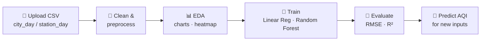
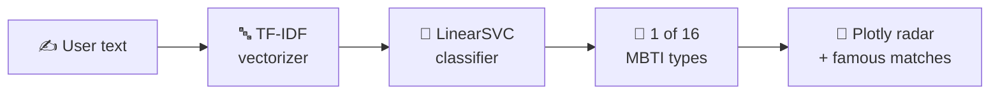
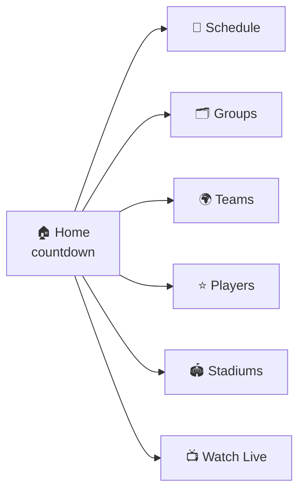

<div align="center">




<br><br>


<a href="https://github.com/Prem2403?tab=followers"></a>
<a href="https://github.com/Prem2403?tab=repositories"></a>

<br><br>

<a href="https://www.linkedin.com/in/prem2403/"></a>
<a href="mailto:pk2262126@gmail.com"></a>
<a href="https://leetcode.com/u/Xk0txwObaY/"></a>
<a href="https://www.codechef.com/users/prem2403"></a>
<a href="https://www.geeksforgeeks.org/profile/pk226nonn"></a>
<a href="https://www.kaggle.com/prem242006"></a>

</div>

---

## 🧑‍💻 `> whoami`

<div align="center">


</div>

<br>

<details>
<summary><b>🎓 Education</b> &nbsp;·&nbsp; <i>click to expand</i></summary>
<br>

B.Tech in **Computer Science & Engineering** with a specialization in **Data Science** at **C. V. Raman Global University**, India.

</details>

<details>
<summary><b>🧭 What I'm exploring</b> &nbsp;·&nbsp; <i>click to expand</i></summary>
<br>


</details>

<details>
<summary><b>💬 Ask me about</b> &nbsp;·&nbsp; <i>click to expand</i></summary>
<br>

- 🤖 Building ML pipelines and Streamlit dashboards
- 🌐 React and full-stack basics
- 🧠 Problem solving and DSA practice

</details>

---

## 🛠️ `> stack`  *(click to expand)*

<details open>
<summary><b>🐍 Languages</b></summary>
<br>


</details>

<details open>
<summary><b>🤖 ML & Data Science</b></summary>
<br>


</details>

<details open>
<summary><b>🌐 Full-Stack</b></summary>
<br>


</details>

<details>
<summary><b>🔧 Tools & Deployment</b></summary>
<br>


</details>

---

## 🚀 `> projects`

<p align="center"><i>👇 Click any card to open the live demo or the source code</i></p>

<table>
<tr>
<td width="50%"><a href="https://landvision-olive.vercel.app/"></a></td>
<td width="50%"><a href="https://github.com/Prem2403/AQI-prediction"></a></td>
</tr>
<tr>
<td width="50%"><a href="https://github.com/Prem2403/Personality-Predictor"></a></td>
<td width="50%"><a href="https://wc-live-hub.netlify.app/"></a></td>
</tr>
</table>

<details>
<summary><b>🔬 Peek under the hood</b> &nbsp;·&nbsp; <i>click to see how they work</i></summary>
<br>

**🌫️ AQI Prediction — pipeline**



**🧩 Personality Predictor — pipeline**



**⚽ FIFA World Cup Live Hub — site map**



</details>

---

## 📊 `> github analytics`

<div align="center">


<br>


<br><br>


</div>

---

## 🧠 `> coding arena`

<div align="center">

<a href="https://leetcode.com/u/Xk0txwObaY/">

</a>

</div>

<br>

|   | Platform | Handle | Profile |
|:-:|:--|:--|:--|
| 🟠 | **LeetCode** | `Xk0txwObaY` | [Open ↗](https://leetcode.com/u/Xk0txwObaY/) |
| 🟤 | **CodeChef** | `prem2403` | [Open ↗](https://www.codechef.com/users/prem2403) |
| 🟢 | **GeeksforGeeks** | `pk226nonn` | [Open ↗](https://www.geeksforgeeks.org/profile/pk226nonn) |
| 🔵 | **Kaggle** | `prem242006` | [Open ↗](https://www.kaggle.com/prem242006) |

---

## 🏆 `> milestones`

```bash
$ cat milestones.log

[✔] Deployed LandVision AI          → predictive analytics, live on Vercel
[✔] Launched FIFA World Cup Live Hub → interactive web app, live on Netlify
[✔] Built ML dashboards              → AQI prediction + MBTI personality predictor
[✔] Opened first pull request        → team collaboration on LandVision (Sep 2026)
[✔] Active on 4 coding platforms     → LeetCode · CodeChef · GFG · Kaggle
[▶] Now learning                     → React · Node.js · MongoDB · SQL · Generative AI
```

---

<div align="center">

### 🤝 Got a project, an internship or an idea? Let's talk.

<a href="mailto:pk2262126@gmail.com"></a>
<a href="https://www.linkedin.com/in/prem2403/"></a>

<br><br>


</div>
